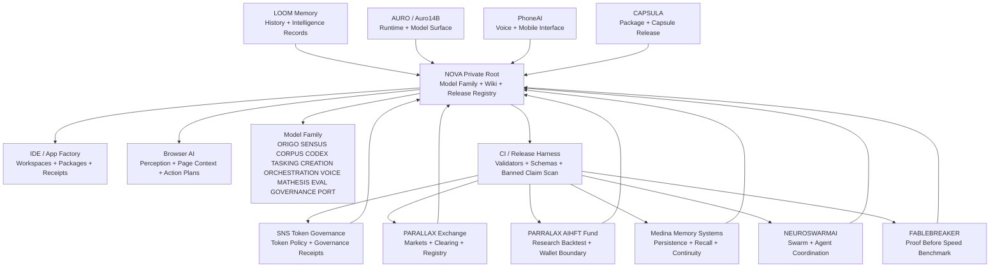

# NOVA / PARALLAX Ecosystem Full Picture

Date: 2026-07-17
Status: active production-harness buildout

## What has been built

The main NOVA private root now carries the model-family release package, wiki, model cards, and production hardening layer. The ecosystem is moving from scattered projects into a release-harness architecture: every repo becomes a feeder with schemas, model cards, release manifests, validation CI, proofs, receipts, and explicit promotion gates.

## Core system

`ItsNotAILABS/NOVA-private-root` is the main model-family root. It contains the wiki, model-family release registry, and the primary operating contracts for coding, tasking, creation, orchestration, conversation, computation, governance, packaging, browser/IDE integration, and model release operations.

## Feeder system

Feeder repos extend the main root by specializing into governance, exchange, trading research, memory, swarm intelligence, benchmark proof, capsule packaging, phone/voice surfaces, and model surfaces.

## Architecture picture

## Current release status

- Main model-family release package: merged into main.
- Main release hardening: production-harness PR in progress.
- SNS feeder harness: PR exists and is being stabilized for CI.
- Formal GitHub Release objects: still require release endpoint access or UI action.

## Strategic conclusion

The correct direction is not one giant product only. The correct architecture is a main NOVA root with feeder repos that mature into proof-producing subsystems. Each feeder repo should publish its own validated release harness, then feed its receipts and contracts back to the main model-family registry.

## Next build priorities

1. Merge model-family production hardening after CI passes.
2. Fix and merge SNS production harness after CI passes.
3. Create PARALLAX Exchange release harness.
4. Create PARRALAX AIHFT research-only release harness.
5. Create MedinaMemorySystems release harness.
6. Create NEUROSWARMAI release harness.
7. Create FABLEBREAKER benchmark release harness.
8. Add a central dashboard that reads every feeder manifest and summarizes readiness.
