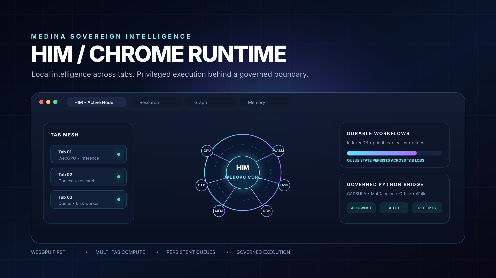
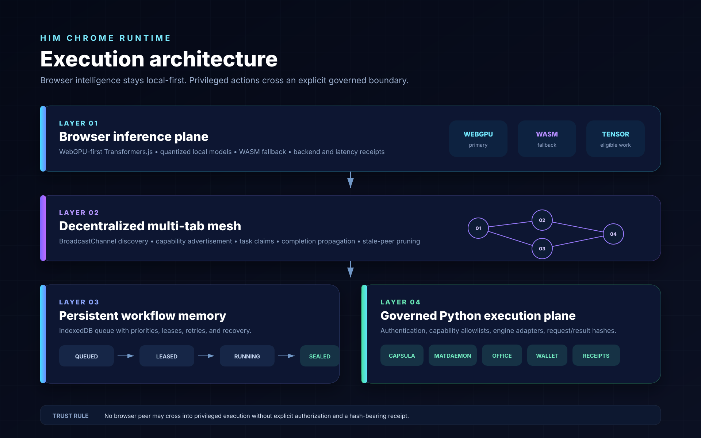

<div align="center">



# HIM Chrome Runtime

### WebGPU-first inference · decentralized multi-tab compute · persistent workflows · governed Python execution

[](https://github.com/ItsNotAILABS/NOVA-private-root/actions/workflows/chrome-webgpu-runtime.yml)


</div>

---

HIM Chrome Runtime extends the merged adaptive Auro skill-organ envelope into a browser-native intelligence layer. It keeps local inference and eligible tensor work inside Chrome, distributes context and tasks across tabs, persists workflows through tab loss, and crosses into Python only through an authenticated capability boundary with request/result hashes.

## Architecture



| Plane | Responsibility | Primary mechanism | Fallback / boundary |
|---|---|---|---|
| **Inference** | Local model generation and eligible tensor work | WebGPU + `@huggingface/transformers` | WASM, then governed Python |
| **Mesh** | Peer discovery and task distribution across tabs | `BroadcastChannel` | Stale-peer pruning and lease recovery |
| **Workflow memory** | Durable prioritized work queues | IndexedDB | Expired leases return to the queue |
| **Execution** | Python tools, CAPSULA, MatDaemon, Office, wallet, receipts | Authenticated HTTP bridge | Capability denial with signed-style hash receipt |

## Core capabilities

### WebGPU-first local inference

- Detects browser WebGPU support at runtime.
- Loads quantized local models through current Transformers.js.
- Uses WASM when WebGPU is unavailable.
- Records the selected backend, model identifier, and inference latency.
- Keeps remote execution behind the governed bridge instead of silently bypassing policy.

### Decentralized multi-tab worker mesh

Every participating tab becomes a discoverable worker node with explicit capabilities.

- Peer identities use browser-native UUIDs.
- Heartbeats advertise availability, WebGPU support, and task capabilities.
- Task claims, completions, and failures propagate through `BroadcastChannel`.
- Stale peers are removed automatically.
- Tabs cooperate instead of duplicating the same inference or workflow task.

### Persistent workflow queues

The IndexedDB queue preserves work independently of any one page lifecycle.

```text
queued → leased → running → completed
                  ├────────→ failed
                  └────────→ denied
```

Each task carries priority, attempt count, lease owner, lease expiry, timestamps, result, and error state. Abandoned leases can be recovered after a tab closes or crashes.

### Governed HIM / Python bridge

The browser may request privileged work, but it cannot execute arbitrary host commands directly.

Supported capability lanes:

- `python`
- `capsula`
- `matdaemon`
- `office`
- `wallet`
- `receipt`

The bridge independently enforces authentication and capability allowlists. Every request produces a SHA-256 request hash; completed responses produce a response hash and a `medina.chrome.bridge.receipt.v1` record.

## Trust boundary

> Browser peers can perform local inference and unprivileged tensor work. Python remains the execution and training authority for checkpoint updates, CAPSULA, MatDaemon, Office, wallet operations, task workers, and receipt production.

The current Python adapters are safe dispatch placeholders. They acknowledge and receipt authorized capability requests but do not claim that the complete external engines are already connected.

## Run locally

```bash
cd integrations/chrome-runtime
npm install
npm run typecheck
npm run build
```

Start the governed Python bridge:

```bash
export HIM_BRIDGE_TOKEN='replace-me'
python bridge/server.py
```

Create the browser runtime:

```ts
import { ChromeRuntime } from './dist/index.js';

const runtime = new ChromeRuntime(
  'http://127.0.0.1:8092',
  'replace-me'
);

runtime.start();

await runtime.mesh.enqueue('inference', {
  modelId: '/models/auro-browser',
  prompt: 'Route this task through the embedded organs.'
}, 10);

setInterval(() => runtime.workOnce(), 250);
```

## Renderer and execution ladder

1. **WebGPU** — primary local inference and eligible tensor acceleration.
2. **WASM** — browser-local fallback when WebGPU is unavailable.
3. **Governed Python** — privileged tools, training, checkpoint mutation, and external engines.

No fallback may silently bypass capability checks or execution receipts.

## Validation

The `Chrome WebGPU Runtime` workflow verifies:

- Node 22 dependency installation
- strict TypeScript type checking
- production TypeScript build
- Python 3.11 bridge compilation
- bridge HTTP health response
- declared CAPSULA capability

## Production next layer

- Wire the runtime into the Chrome Manifest V3 service worker and side panel.
- Add WebGPU device-loss recovery and model cache receipts.
- Add explicit read-versus-execution authorization at the extension boundary.
- Connect governed engine adapters to CAPSULA, MatDaemon, Office, wallet, and task-worker APIs.
- Add browser integration tests with multiple controlled tabs and IndexedDB lease recovery.
- Add checkpoint-compatible ONNX export and tokenizer packaging for HIM-native weights.

---

<div align="center">

**Browser intelligence is local-first. Privileged execution is explicit, governed, and receipted.**

</div>
